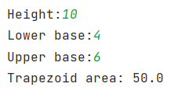

# Упражнение 2


## Код

### Клиента
```python
import socket
import pickle


def main():
    conn = socket.socket(socket.AF_INET, socket.SOCK_STREAM)
    conn.connect(('127.0.0.1', 14900))

    height = int(input('Height:'))
    lower_base = int(input('Lower base:'))
    upper_base = int(input('Upper base:'))

    trap_data = (lower_base, upper_base, height)
    encoded_trap_data = pickle.dumps(trap_data)
    conn.send(encoded_trap_data)

    server_response_enc = conn.recv(12000)
    server_response_dec = server_response_enc.decode('utf-8')
    print(f'Trapezoid area: {server_response_dec}')


if __name__ == '__main__':
    main()
```

### Сервера

```python

import socket
import pickle


def main():
    conn = socket.socket(socket.AF_INET, socket.SOCK_STREAM)
    conn.bind(('127.0.0.1', 14900))
    conn.listen(10)

    client_socket, address = conn.accept()
    encoded_data = client_socket.recv(12000)
    lower_base, upper_base, height = pickle.loads(encoded_data)

    area = (upper_base + lower_base) / 2 * height
    area = round(area, 2)

    area_encoded = str(area).encode('utf-8')
    client_socket.send(area_encoded)
    conn.close()


if __name__ == '__main__':
    main()
```

## Демонстрация


*Что видит клиент*