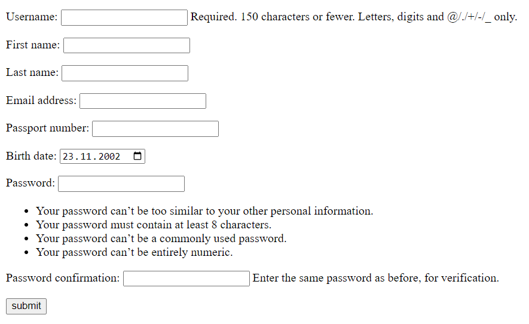
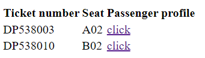
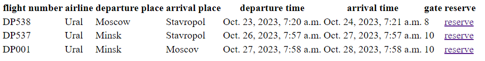
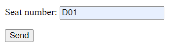
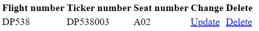
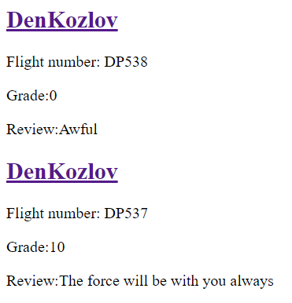

# Views

## UserRegistration
url: `/aviasales/user_registration`

Форма регистрации пользователя



```python
class UserRegistration(View):
    template_path = get_template_path('user_registration')
    form_class = forms.UserRegisterForm

    def get(self, request, *args, **kwargs):
        form = self.form_class()
        context = {'form': form}
        return render(request, self.template_path, context)

    def post(self, request, *args, **kwargs):
        form = self.form_class(request.POST)
        if form.is_valid():
            user = form.save()
            return redirect(user.get_absolute_url())
        context = {'form': form}
        return render(request, self.template_path, context)
```

```html
<!DOCTYPE html>
<html lang="en">
<head>
    <meta charset="UTF-8">
    <title>User registration</title>
</head>
<body>
    <form method="post">
        
        {{ form.as_p }}
        <input type="submit" value="submit">
    </form>
</body>
</html>
```

## UserDetail
url: `aviasales/user_detail/<int:pk>`

Страница с информацией о пользователе


```python
class UserDetail(DetailView):
    model = user_model
    template_name = 'aviasales/user_detail.html'
```

```html
<!DOCTYPE html>
<html lang="en">
<head>
    <meta charset="UTF-8">
    <title>{{ object.username }} profile</title>
</head>
<body>
    <h1>{{ object.username }}</h1>
    <ul>
        <li>Фамилия имя: {{ object.first_name }} {{ object.last_name }}</li>
        
            <li>Email: {{ object.email }}</li>
        
        
            <li>Дата рождения: {{ object.birth_date }}</li>
        
        
            <li>Номер паспорта: {{ object.passport_number }}</li>
        
    </ul>

</body>
</html>
```

## FlightInfo
url: `aviasales/flight_info/<int:flight_pk>`

Страница с информацией о других участниках полета



```python
class FlightInfo(View):
    template_path = get_template_path('flight_info')

    def get(self, request, flight_pk):
        user_flights = models.UserFlight.objects.filter(flight__pk=flight_pk,
                                                        approved=True)
        context = {'user_flights': user_flights}
        return render(request, self.template_path, context=context)
```

```html
<!DOCTYPE html>
<html lang="en">
<head>
    <meta charset="UTF-8">
    <title>Flight info</title>
</head>
<body>

    
        <h2>No approved tickets for that flight</h2>
    
        <table>
            <tr>
                <th>Ticket number</th>
                <th>Seat</th>
                <th>Passenger profile</th>
            </tr>


            
                <tr>
                    <td>{{ user_flight.ticket_number }}</td>
                    <td>{{ user_flight.seat_number }}</td>
                    <td>
                        <a href="{{ user_flight.user.get_absolute_url }}">
                            click
                        </a>
                    </td>
                </tr>
            
        </table>
    


</body>
</html>
```

## UserFlightsReservationList
url: `aviasales/userflight_reservation_list`

Страница, отображающая список доступных для резервирования полетов



```python
class UserFlightsReservationList(LoginRequiredMixin, ListView):
    model = models.Flight
    template_name = get_template_path('userflight_reservation_list')

    def get_queryset(self):
        queryset = super().get_queryset()
        user = self.request.user
        reserved_flights_pks = {i.flight.pk for i in user.userflight_set.get_queryset()}
        queryset = queryset.exclude(pk__in=reserved_flights_pks)
        return queryset
```

```html
<!DOCTYPE html>
<html lang="en">
<head>
    <meta charset="UTF-8">
    <title>Flight reservation</title>
</head>
<body>
    
         <p>No flights you can reserve</p>
    
        <table>
            <tr>
                <th>flight number</th>
                <th>airline</th>
                <th>departure place</th>
                <th>arrival_place</th>
                <th>departure_time</th>
                <th>arrival_tim</th>
                <th>gate</th>
                <th>reserve</th>
            </tr>
            
                <tr>
                    <td>{{ obj.flight_number }}</td>
                    <td>{{ obj.airline }}</td>
                    <td>{{ obj.departure_place }}</td>
                    <td>{{ obj.arrival_place }}</td>
                    <td>{{ obj.departure_time }}</td>
                    <td>{{ obj.arrival_time }}</td>
                    <td>{{ obj.gate }}</td>
                    <td><a href="">reserve</a></td>
                </tr>
            
        </table>
    
</body>
</html>
```


## UserFlightsReservationForm
url: `aviasales/userflight_reservation_form/<int:flight_pk>`

Форма для бронирования полета



```python
class UserFlightsReservationForm(LoginRequiredMixin, View):
    template_path = get_template_path('userflight_reservation_form')
    form_class = forms.ReservationForm

    last_get_flight = None

    def get(self, request, flight_pk, *args, **kwargs):
        user = request.user
        flight = models.Flight.objects.get(pk=flight_pk)
        self.last_get_flight = flight
        form = self.form_class(user, flight)
        context = {'form': form}
        return render(request, self.template_path, context)

    def post(self, request, flight_pk, *args, **kwargs):
        user = request.user
        flight = models.Flight.objects.get(pk=flight_pk)
        form = self.form_class(user, flight, request.POST)
        if form.is_valid():
            form.save()
            return redirect(reverse('aviasales:userflight_reservation_list'))
        context = {'form': form}
        return render(request, self.template_path, context)
```

```html
<!DOCTYPE html>
<html lang="en">
<head>
    <meta charset="UTF-8">
    <title>Reservation form</title>
</head>
<body>
     <form method="POST">
        
        {{ form.as_p }}
        <input type="submit" value="Send">
     </form>
</body>
</html>
```

## MyFlights
url: `/aviasales/my_flights`

Страница, на которой можно просматривать, удалять и изменять подтвержденные полеты



```python
class MyFlights(LoginRequiredMixin, View):

    template_path = get_template_path('my_flights')

    def get(self, request):
        user = request.user
        user_flights = models.UserFlight.objects.filter(user__pk=user.pk, approved=True)
        context = {'user_flights': user_flights}
        return render(request, self.template_path, context)
```

```html
<!DOCTYPE html>
<html lang="en">
<head>
    <meta charset="UTF-8">
    <title>My Flights</title>
</head>
<body>

    
        You have no flights
    
        <table>
            <tr>
                <th>Flight number</th>
                <th>Ticker number</th>
                <th>Seat number</th>
                <th>Change</th>
                <th>Delete</th>
            </tr>

            
                <tr>
                    <td>{{ user_flight.flight.flight_number }}</td>
                    <td>{{ user_flight.ticket_number }}</td>
                    <td>{{ user_flight.seat_number }}</td>
                    <td>
                        <a href="{{ user_flight.get_update_url }}">
                            Update
                        </a>
                    </td>
                    <td>
                        <a href="{{ user_flight.get_delete_url }}">
                            Delete
                        </a>
                    </td>
                </tr>
            
        </table>

    

</body>
</html>
```

## UserFlightUpdateView


Форма для изменения данных полета

url: `aviasales/userflight_update/<int:pk>`

```python
class UserFlightUpdateView(UserPassesTestMixin, UpdateView):
    model = models.UserFlight
    fields = ['seat_number']
    success_url = reverse_lazy('aviasales:my_flights')
    def test_func(self):
        userflight_url_pk = self.kwargs[self.pk_url_kwarg]
        user = self.request.user
        try:
            user.userflight_set.get(pk=userflight_url_pk, approved=True)
            return True
        except models.UserFlight.DoesNotExist:
            return False
```

```html
<!DOCTYPE html>
<html lang="en">
<head>
    <meta charset="UTF-8">
    <title>User Flight Form</title>
</head>
<body>
    <form method="POST">
        
        {{ form.as_p }}
        <input type="submit" value="Send">
    </form>
</body>
</html>
```


## UserFlightDeleteView
url: `aviasales/userflight_delete/<int:pk>`

Форма для удаления резервации на полет


```python
class UserFlightDeleteView(UserPassesTestMixin, DeleteView):
    model = models.UserFlight
    success_url = reverse_lazy('aviasales:my_flights')

    def test_func(self):
        userflight_url_pk = self.kwargs[self.pk_url_kwarg]
        user = self.request.user
        try:
            user.userflight_set.get(pk=userflight_url_pk, approved=True)
            return True
        except models.UserFlight.DoesNotExist:
            return False
```

```html
<!DOCTYPE html>
<html lang="en">
<head>
    <meta charset="UTF-8">
    <title>Confirm user flight delete</title>
</head>
<body>
    <h2>Delete?</h2>
    <form method="post">
        
        <input type="submit" value="Yes">
    </form>

    <a href="">Return to my flights page</a>
</body>
</html>
```


## ReviewCreateView
url: `aviasales/review_create`

Форма для написания отзыва на полет


```python
class ReviewCreateView(LoginRequiredMixin, View):
    template_path = get_template_path('review_form')
    form_class = forms.ReviewForm

    def get(self, request, *args, **kwargs):
        user = request.user
        form = self.form_class(user)
        context = {'form': form}
        return render(request, self.template_path, context)

    def post(self, request, *args, **kwargs):
        user = request.user
        form = self.form_class(user, request.POST)
        if form.is_valid():
            form.save()
            return redirect(reverse('aviasales:review_create'))
        context = {'form': form}
        return render(request, self.template_path, context)
```

```html
<!DOCTYPE html>
<html lang="en">
<head>
    <meta charset="UTF-8">
    <title>Add review</title>
</head>
<body>
    <form method="post">
        
        {{ form.as_p }}
        <input type="submit" value="Add">
    </form>
</body>
</html>
```


## ReviewListView
url: `aviasales/review_list`

Страница с отзывами



```python
class ReviewListView(ListView):
    model = models.Review
```

```html
<!DOCTYPE html>
<html lang="en">
<head>
    <meta charset="UTF-8">
    <title>Review list</title>
</head>
<body>
        
            <h2><a href="{{ obj.user_flight.user.get_absolute_url }}">
                {{  obj.user_flight.user.get_username }}
            </a></h2>
            <p>Flight number: {{ obj.user_flight.flight.flight_number }}</p>
            <p>Grade:{{ obj.grade }}</p>
            <p>Review:{{ obj.text }}</p>
        
            <p>no reviews</p>
        
</body>
</html>
```